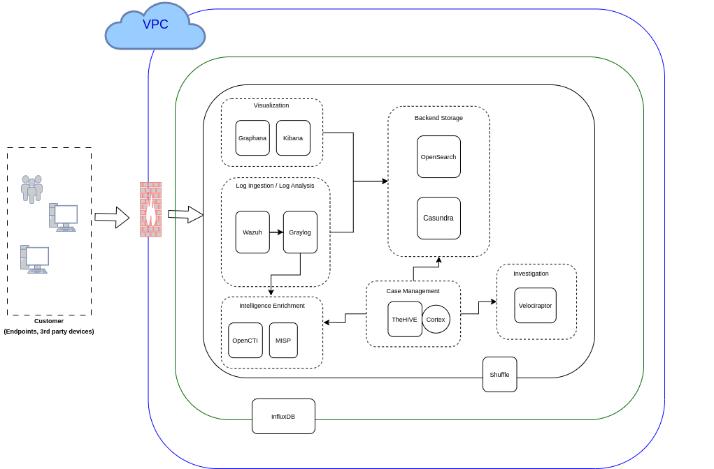

# OSS Tools

### Log Analysis

- [Wazuh](https://github.com/wazuh)

### Log Ingestion

- [Graylog](https://github.com/Graylog2)

### Backend Storage

- [Elasticsearch](https://github.com/elastic/elasticsearch)
- [OpenSearch](https://github.com/opensearch-project/OpenSearch)
- [Wazuh Indexer](https://github.com/wazuh/wazuh-indexer) : OpenSearch Fork

### Visualization

- [Graphana](https://github.com/grafana/grafana)
- [Kibana](https://github.com/elastic/kibana) : browser-based analytics and search dashboard for Elasticsearch

### Intelligence Enrichment

- [OpenCTI](https://github.com/OpenCTI-Platform/opencti)
- [MISP](https://github.com/MISP/MISP)

### Case Management

- [TheHIVE](https://github.com/TheHive-Project/TheHive)
- [Cortex](https://github.com/cortexproject/cortex)

### Automation

- [Shuffle](https://github.com/Shuffle/Shuffle)

### Investigation

- [Velociraptor](https://github.com/Velocidex/velociraptor)

### Health Monitoring

- [InfulxDB](https://github.com/influxdata/influxdb)
- [Uptime Kuma](https://github.com/louislam/uptime-kuma)

## Architecture Diagram

## Deployment Strategy

1. Wazuh Indexer (Opensearch)
2. Wazuh Dashboards (Opensearch Dashboards)
3. Graylog
4. Wazuh Manager / Agents
5. Graphana
6. MISP
7. OpenCTI
8. TheHIVE / Cortex
9. Velociraptor / Agents
10. Shuffle
11. InfluxDB / Telegraf