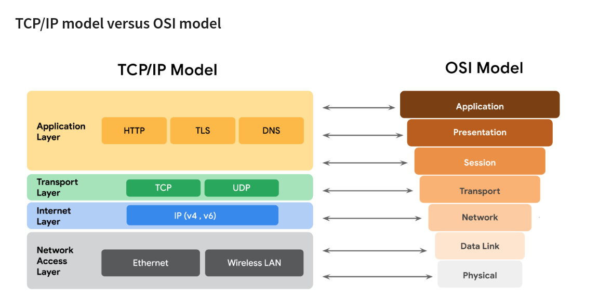
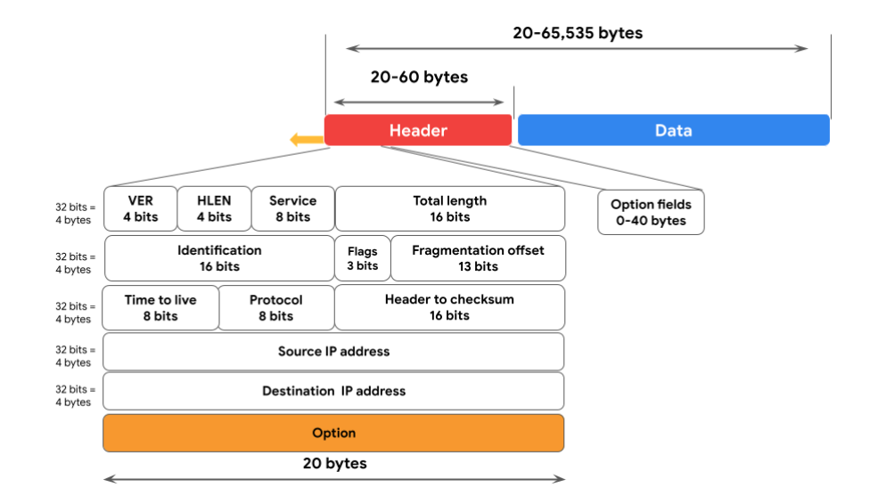
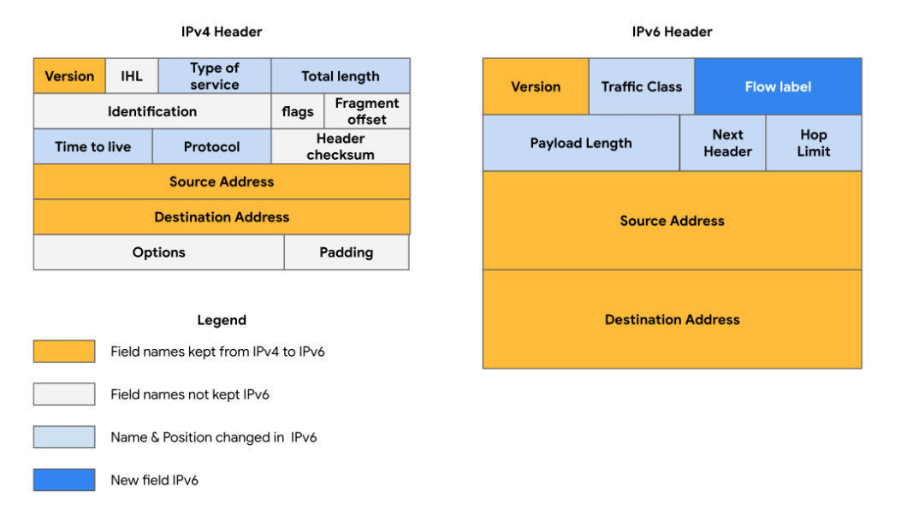

# Network architecture

## Network Tools

### Firewalls
A firewall is a network security device that monitors traffic to or from your network. It is like your first line of defense.  
Firewalls often reside between the secured and controlled internal network and the untrusted network resources outside the organization, such as the internet.  

### Servers  
Servers provide information and services for devices like computers, smart home devices, and smartphones on the network. The devices that connect to a server are called clients.  
Examples: DNS servers that perform domain name lookups for internet sites, file servers that store and retrieve files from a database, and corporate mail servers that organize mail for a company. 

### Hubs and switches  

A hub is a device that provides a common point of connection for all devices directly connected to it. 

 A switch forwards packets between devices directly connected to it. They analyze the destination address of each data packet and send it to the intended device.   Switches maintain a MAC address table that matches MAC addresses of devices on the network to port numbers on the switch and forwards incoming data packets according to the destination MAC address. Switches are a part of the data link layer in the TCP/IP model. Overall, switches improve performance and security.

 ### Routers
Routers connect networks and direct traffic, based on the IP address of the destination network. Routers allow devices on different networks to communicate with each other.   
In the TCP/IP model, routers are a part of the network layer. The IP address of the destination network is contained in the IP header. The router reads the IP header information and forwards the packet to the next router on the path to the destination. This continues until the packet reaches the destination network.   

Routers can also include a firewall feature that allows or blocks incoming traffic based on information in the transmission. This stops malicious traffic from entering the private network and damaging the local area network.

### Modems and wireless access points

**Modems** usually connect your home or office with an internet service provider (ISP). ISPs provide internet connectivity via telephone lines or coaxial cables. Modems receive transmissions or digital signals from the internet and translate them into analog signals that can travel through the physical connection provided by your ISP. Usually, modems connect to a router that takes the decoded transmissions and sends them on to the local network.
  
A **wireless access point** sends and receives digital signals over radio waves creating a wireless network. Devices with wireless adapters connect to the access point using Wi-Fi. Wi-Fi refers to a set of standards that are used by network devices to communicate wirelessly. 

## Cloud computing and software-defined networks

**Cloud computing** refers to the practice of using remote servers, applications, and network services that are hosted on the internet instead of at a physical location owned by the company.  
A cloud service provider (CSP) is a company that offers cloud computing services. Companies can pay for the storage and services they need and consume them through the CSP’s application programming interface (API) or web console.  
CSPs provide three main categories of services:

- **Software as a service (SaaS)** refers to software suites operated by the CSP that a company can use remotely without hosting the software. 
- **Infrastructure as a service (IaaS)** refers to the use of virtual computer components offered by the CSP. These include virtual containers and storage that are configured remotely through the CSP’s API or web console. 
- **Platform as a service (PaaS)** refers to tools that application developers can use to design custom applications for their company. Custom applications are designed and accessed in the cloud and used for a company’s specific business needs.

### Hybrid Cloud Environments  
When organizations use a CSP’s services in addition to their on-premise computers, networks, and storage, it is referred to as a hybrid cloud environment.

### Software-defined networks

Software-defined networks (SDNs) are made up of virtual network devices and services. Just like CSPs provide virtual computers, many SDNs also provide virtual switches, routers, firewalls, and more. Most modern network hardware devices also support network virtualization and software-defined networking.   

This means that physical switches and routers use software to perform packet routing. In the case of cloud networking, the SDN tools are hosted on servers located at the CSP’s data center.

#### Benefits of Cloud Computing and software-defined networks

- Reliability
- Cost
- Scability

## Network Communication

A **data packet** is a basic unit of information that travels from one device to another within a network.  
A data packet is very similar to a physical letter. It contains a header that includes the internet protocol address, the IP address, and the media access control, or MAC, address of the destination device. It also includes a protocol number that tells the receiving device what to do with the information in the packet.   

Then there's the body of the packet, which contains the message that needs to be transmitted to the receiving device.   
Finally, at the end of the packet, there's a footer, similar to a signature on a letter, the footer signals to the receiving device that the packet is finished.    

**Bandwidth** refers to the amount of data a device receives every second. You can calculate bandwidth by dividing the quantity of data by the time in seconds.  

**Speed** refers to the rate at which data packets are received or downloaded. 

### The TCP/IP model
The TCP/IP model is a framework used to visualize how data is organized and transmitted across a network. 

**TCP, or Transmission Control Protocol**, is an internet communication protocol that allows two devices to form a connection and stream data. The protocol includes a set of instructions to organize data, so it can be sent across a network. It also establishes a connection between two devices and makes sure that packets reach their appropriate destination.

**The IP in TCP/IP** stands for Internet Protocol. IP has a set of standards used for routing and addressing data packets as they travel between devices on a network. Included in the Internet Protocol (IP) is the IP address that functions as an address for each private network.

Within the operating system of a network device, **a port** is a software-based location that organizes the sending and receiving of data between devices on a network. Ports divide network traffic into segments based on the service they will perform between two devices.

The TCP/IP model has four layers: 

1. Network access layer   
   - Also called the data link layer, deals with the creation of data packets and their tramsmission across a network.  
   - Corresponds to physical hardware involved in network transmission. Hubs, modems, cables, and wiring  
   - The Address Resolution Protocol(ARP) is part of the network acccess layer. Since MAC addresses are used to identify hosts on the same physical network, ARP is  needed to map IP addresses to MAC addresses for local network communication.

2. Internet layer  
   - Also called the network layer, is responsible for ensuring the delivery to the destination host which potentially resides on a different network.  
   - It ensures IP addresses are attached to data packets to indicate the location of the sender and receiver.   
   - Common Protocols that operate at the internet layer are:   
    - **Internet Protocol(IP)** : IP sends the data packets to the correct destination and relies on the Transmission Control Protocol/User Datagram Protocol (TCP/UDP) to deliver them to the corresponding service. IP packets allow communication between two networks. They are routed from the sending network to the receiving network. TCP in particular retransmits any data that is lost or corrupt.

    - **Internet Control Message Protocol(ICMP)** : The ICMP shares error information and status updates of data packets. This is useful for detecting and troubleshooting network errors. The ICMP reports information about packets that were dropped or that disappeared in transit, issues with network connectivity, and packets redirected to other routers.

3. Transport layer  
   Responsible for delivering data between two systems or networks and includes protocols to control the flow of traffic across a network.  

   **Transmission Control Protocol(TCP)**  
   An internet communication protocol that allows two devices to form a connection and stream data. It ensures that data is reliably transmitted to the destination service. TCP contains the port number of the intended destination service, which resides in the TCP header of a TCP/IP packet.  

   **User Datagram Protocol**  
   A connectionless protocol that does not establish a connection between devices before transmissions.  
   It is used mostly for performance sensitive applications that operate in real time, such as video streaming.

4. Application layer  
   It is responsible for making network requests or responding to requests. This layer defines which internet services and applications any user can access. Protocols in the application layer determine how the data packets will interact with receiving devices. Some common protocols used on this layer are:
    - Hypertext transfer protocol (HTTP)
    - Simple mail transfer protocol (SMTP)
    - Secure shell (SSH)
    - File transfer protocol (FTP)
    - Domain name system (DNS)

### The OSI Model

The OSI model is a standardized concept that describes the seven layers computers use to communicate and send data over the network. Network and security professionals often use this model to communicate with each other about potential sources of problems or security threats when they occur.

1. Layer 7: Application Layer  
   User connection to the internet via applications and requests.   
   Example:   ***Using a web browser*** The internet browser uses HTTP or HTTPS to send and receive information from the website server. Also, web browsers use the domain name system (DNS) protocol to translate website domain names into IP addresses.   
   ***The email application*** uses simple mail transfer protocol (SMTP) to send and receive email information.  

2. Layer 6: Presentation Layer  
   Functions at the presentation layer involve **data translation and encryption** for the network. This layer adds to and replaces data with formats that can be understood by applications (layer 7) on both sending and receiving systems. Formats at the user end may be different from those of the receiving system. Processes at the presentation layer require the use of a standardized format.  
   
   Some formatting functions that occur at layer 6 include encryption, compression, and confirmation that the character code set can be interpreted on the receiving system. One example of encryption that takes place at this layer is SSL, which encrypts data between web servers and browsers as part of websites with HTTPS.

3. Layer 5: Session Layer  
   A session describes when a connection is established between two devices. An open session allows the devices to communicate with each other. Session layer protocols keep the session open while data is being transferred and terminate the session once the transmission is complete.   
   
   The session layer is also responsible for activities such as authentication, reconnection, and setting checkpoints during a data transfer. If a session is interrupted, checkpoints ensure that the transmission picks up at the last session checkpoint when the connection resumes. Sessions include a request and response between applications. Functions in the session layer respond to requests for service from processes in the presentation layer (layer 6) and send requests for services to the transport layer (layer 4).

4. Layer 4: Transport Layer  
   The transport layer is responsible for delivering data between devices. This layer also handles the speed of data transfer, flow of the transfer, and breaking data down into smaller segments to make them easier to transport.   
   **Segmentation** is the process of dividing up a large data transmission into smaller pieces that can be processed by the receiving system. These segments need to be reassembled at their destination so they can be processed at the session layer (layer 5). The speed and rate of the transmission also has to match the connection speed of the destination system.   
   TCP and UDP are transport layer protocols. 

3. Layer 3: Network Layer  
   The network layer oversees receiving the frames from the data link layer (layer 2) and delivers them to the intended destination. The intended destination can be found based on the address that resides in the frame of the data packets. Data packets allow communication between two networks. These packets include IP addresses that tell routers where to send them. They are routed from the sending network to the receiving network. 

2. Layer 2: Data Link Layer  
   The data link layer organizes sending and receiving data packets within a single network. The data link layer is home to switches on the local network and network interface cards on local devices.  

   Protocols like network control protocol (NCP), high-level data link control (HDLC), and synchronous data link control protocol (SDLC) are used at the data link layer.

1. Layer 1: Physical Layer  
   To travel across an ethernet or coaxial cable, a data packet needs to be translated into a stream of 0s and 1s. The stream of 0s and 1s are sent across the physical wiring and cables, received, and then passed on to higher levels of the OSI model.

## Local and Wide Network Communication

### Network Layer Operations

- Function of the network layer is to organize the addressing and delivery of data packets across the network from the host device to the destination device.
- This includes directing the packets from one router to another router across the internet, till it reaches the **internet protocol (IP) address** of the destination network.   
- The destination IP address is contained within the header of each data packet. This address will be stored for future routing purposes in **routing tables** along the packet’s path to its destination.  

- All data packets include an IP address. A data packet is also referred to as an **IP packet for TCP connections** or **a datagram for UDP connections**.  
- A router uses the IP address to route packets from network to network based on information contained in the IP header of a data packet.   
- Header information communicates more than just the address of the destination. It also includes information such as the source IP address, the size of the packet, and which protocol will be used for the data portion of the packet. 

#### IPv4 Packet Format

- **IPv4 Header**  
   An IPv4 header format is determined by the IPv4 protocol and includes the IP routing information that devices use to direct the packet. The size of the IPv4 header ranges from 20 to 60 bytes. The first 20 bytes are a fixed set of information containing data such as the source and destination IP address, header length, and total length of the packet. The last set of bytes can range from 0 to 40 and consists of the options field.
  
- **Data**  
  The length of the data section of an IPv4 packet can vary greatly in size. However, the maximum possible size of an IPv4 packet is 65,535 bytes. It contains the message being transferred over the internet, like website information or email text. 

***There are 13 fields within the header of an IPv4 packet:**  

- Version (VER): This 4 bit component tells receiving devices what protocol the packet is using. The packet used in the illustration above is an IPv4 packet.

- IP Header Length (HLEN or IHL): HLEN is the packet’s header length. This value indicates where the packet header ends and the data segment begins. 

- Type of Service (ToS): Routers prioritize packets for delivery to maintain quality of service on the network. The ToS field provides the router with this information.

- Total Length: This field communicates the total length of the entire IP packet, including the header and data. The maximum size of an IPv4 packet is 65,535 bytes.

- Identification: IPv4 packets can be up to 65, 535 bytes, but most networks have a smaller limit. In these cases, the packets are divided, or fragmented, into smaller IP packets. The identification field provides a unique identifier for all the fragments of the original IP packet so that they can be reassembled once they reach their destination.

- Flags: This field provides the routing device with more information about whether the original packet has been fragmented and if there are more fragments in transit.

- Fragmentation Offset: The fragment offset field tells routing devices where in the original packet the fragment belongs.

- Time to Live (TTL): TTL prevents data packets from being forwarded by routers indefinitely. It contains a counter that is set by the source. The counter is decremented by one as it passes through each router along its path. When the TTL counter reaches zero, the router currently holding the packet will discard the packet and return an ICMP Time Exceeded error message to the sender. 

- Protocol: The protocol field tells the receiving device which protocol will be used for the data portion of the packet.

- Header Checksum: The header checksum field contains a checksum that can be used to detect corruption of the IP header in transit. Corrupted packets are discarded.

- Source IP Address: The source IP address is the IPv4 address of the sending device.

- Destination IP Address: The destination IP address is the IPv4 address of the destination device.

- Options: The options field allows for security options to be applied to the packet if the HLEN value is greater than five. The field communicates these options to the routing devices.

#### Difference between IPv4 and IPv6
Some of the key differences between IPv4 and IPv6 include the length and the format of the addresses. IPv4 addresses are made up of four decimal numbers separated by periods, each number ranging from 0 to 255. Together the numbers span 4 bytes, and allow for up to 4.3 billion possible addresses. An example of an IPv4 address would be: 198.51.100.0. IPv6 addresses are made of eight hexadecimal numbers separated by colons, each number consisting of up to four hexadecimal digits. Together, all numbers span 16 bytes, and allow for up to 340 undecillion addresses (340 followed by 36 zeros). An example of an IPv6 address would be: 2002:0db8:0000:0000:0000:ff21:0023:1234.

Note: to represent one or more consecutive sets of all zeros, you can replace the zeros with a double colon "::", so the above IPv6 address would be "2002:0db8::ff21:0023:1234."

There are also some differences in the layout of an IPv6 packet header. The IPv6 header format is much simpler than IPv4. For example, the IPv4 Header includes the IHL, Identification, and Flags fields, whereas the IPv6 does not. The IPv6 header only introduces the Flow Label field, where the Flow Label identifies a packet as requiring special handling by other IPv6 routers.   

There are some important security differences between IPv4 and IPv6. IPv6 offers more efficient routing and eliminates private address collisions that can occur on IPv4 when two devices on the same network are attempting to use the same address. 

