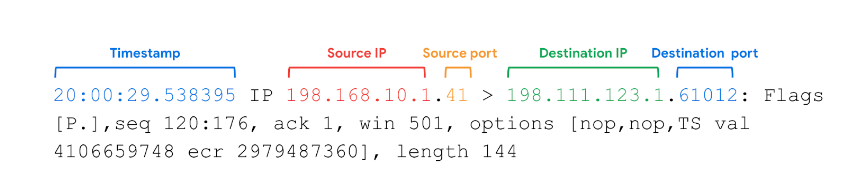

# Network Intrusions

## Network Intrusion tactics
Attackers can infiltrate networks via malware, spoofing, or packet sniffing. Network operations can also be disrupted by attacks such as packet flooding.  

### Network interception attacks
Network interception attacks work by intercepting network traffic and stealing valuable information or interfering with the transmission in some way.   

Malicious actors can use hardware or software tools to capture and inspect data in transit. This is referred to as **packet sniffing**. In addition to seeing information that they are not entitled to, malicious actors can also intercept network traffic and alter it. These attacks can cause damage to an organization’s network by inserting malicious code modifications or altering the message and interrupting network operations.  

Other types of network interception attacks: **on-path attacks** and **replay attacks**.  

### Backdoor attacks
A backdoor attack is another type of attack you will need to be aware of as a security analyst. An organization may have a lot of security measures in place, including cameras, biometric scans and access codes to keep employees from entering and exiting without being seen. However, an employee might work around the security measures by finding a backdoor to the building that is not as heavily monitored, allowing them to sneak out for the afternoon without being seen.   

n cybersecurity, backdoors are weaknesses intentionally left by programmers or system and network administrators that bypass normal access control mechanisms. Backdoors are intended to help programmers conduct troubleshooting or administrative tasks. However, backdoors can also be installed by attackers after they’ve compromised an organization to ensure they have persistent access.  

Once the hacker has entered an insecure network through a backdoor, they can cause extensive damage: installing malware, performing a denial of service (DoS) attack, stealing private information or changing other security settings that leaves the system vulnerable to other attacks. **A DoS attack** is an attack that targets a network or server and floods it with network traffic.

## Secure networks against Denial of Service(DoS) Attack

A **denial of service** attack is an attack that targets a network or server and floods it with network traffic.   

The objective of a denial of service attack, or a DoS attack, is to disrupt normal business operations by overloading an organization's network. The goal of the attack is to send so much information to a network device that it crashes or is unable to respond to legitimate users. This means that the organization won't be able to conduct their normal business operations, which can cost them money and time. A network crash can also leave them vulnerable to other security threats and attacks.

A **distributed denial of service attack, or DDoS**, is a kind of DoS attack that uses multiple devices or servers in different locations to flood the target network with unwanted traffic. Use of numerous devices makes it more likely that the total amount of traffic sent will overwhelm the target server. 

### Network Level DoS attacks  
These attacks target network bandwidth to slow traffic.

- **A SYN flood attack**  
  A SYN flood attack is a type of DoS attack that simulates the TCP connection and floods the server with SYN packets.   
    - The handshake process that is used to establish a TCP connection between a device and a server.   
    - The first step in the handshake is for the device to send a SYN, or synchronize, request to the server.   
    - Then, the server responds with a SYN/ACK packet to acknowledge the receipt of the device's request and leaves a port open for the final step of the handshake.   
    - Once the server receives the final ACK packet from the device, a TCP connection is established.  
    - Malicious actors can take advantage of the protocol by flooding a server with SYN packet requests for the first part of the handshake.   
    - But if the number of SYN requests is larger than the number of available ports on the server, then the server will be overwhelmed and become unable to function.

- **ICMP flood attack**  
  ICMP is an internet protocol used by devices to tell each other about data transmission errors across the network. 
  An ICMP flood attack is a type of DoS attack performed by an attacker repeatedly sending ICMP packets to a network server.  
    - This forces the server to send an ICMP packet. 
    - This eventually uses up all the bandwidth for incoming and outgoing traffic and causes the server to crash.

- **Ping of Death**  
  SYN flood and ICMP flood, take advantage of communication protocols by sending an overwhelming number of requests.   
    - **A ping of death** attack is a type of DoS attack that is caused when a hacker pings a system by sending it an oversized ICMP packet that is bigger than 64 kilobytes, the maximum size for a correctly formed ICMP packet.   
    - Pinging a vulnerable network server with an oversized ICMP packet will overload the system and cause it to crash. 

### tcpdump Logs

A **network protocol analyzer**, sometimes called a packet sniffer or a packet analyzer, is a tool designed to capture and analyze data traffic within a network.    

Examples are, 
- Wireshark
- tcpdump
- SolarWinds NetFlow Traffic Analyzer
- ManageEngine OpManager
- Azure Network Watcher

#### tcpdump

tcpdump is a command-line network protocol analyzer. It is popular, lightweight–meaning it uses little memory and has a low CPU usage–and uses the open-source libpcap library. tcpdump is text based, meaning all commands in tcpdump are executed in the terminal. It can also be installed on other Unix-based operating systems, such as macOS®. It is preinstalled on many Linux distributions.    

tcpdump provides a brief packet analysis and converts key information about network traffic into formats easily read by humans. It prints information about each packet directly into your terminal. tcpdump also displays the source IP address, destination IP addresses, and the port numbers being used in the communications. 

##### Interpreting output
tcpdump prints the output of the command as the sniffed packets in the command line, and optionally to a log file, after a command is executed. The output of a packet capture contains many pieces of important information about the network traffic.   

Some information you receive from a packet capture includes: 

- Timestamp: The output begins with the timestamp, formatted as hours, minutes, seconds, and fractions of a second.    
- Source IP: The packet’s origin is provided by its source IP address.  
- Source port: This port number is where the packet originated.  
- Destination IP: The destination IP address is where the packet is being transmitted to.   
- Destination port: This port number is where the packet is being transmitted to.

## Network attack tactics and defense

### Packet Sniffing

Packets include a header which contains the sender's and receiver's IP addresses. Packets also contain a body, which may contain valuable information like names, date of birth, personal messages, financial information, and credit card numbers.  

**Packet sniffing** is the practice of using software tools to observe data (capturing and inspecting data) as it moves across a network.  

Packet sniffing can be ***passive or active***.   
**Passive packet sniffing** is a type of attack where data packets are **read in transit**. Since all the traffic on a network is visible to any host on the hub, malicious actors can view all the information going in and out of the device they are targeting. Thinking back to the example of a letter being delivered, we can compare a passive packet sniffing attack to a postal delivery person maliciously reading somebody's mail. The postal worker, or packet sniffer, has the right to deliver the mail, but not the right to read the information inside.   

**Active packet sniffing** is a type of attack where data packets are **manipulated in transit**. This may include injecting internet protocols to redirect the packets to an unintended port or changing the information the packet contains. Active packet sniffing attack would be like a neighbor telling the delivery person "I'll deliver that mail for you," and then reading the mail or changing the letter before putting it in your mailbox. Even though your neighbor knows you and even if they deliver it to the correct house, they are actively going out of their way to engage in malicious behavior.  

### IP Spoofing

IP spoofing is a network attack performed when an attacker changes the source IP of a data packet to impersonate an authorized system and gain access to a network.  
In this kind of attack, the hacker is pretending to be someone they are not so they can communicate over the network with the target computer and get past firewall rules that may prevent outside traffic.    

The device’s **Network Interface Card (NIC)** is a piece of hardware that connects the device to a network. The NIC reads the data transmission, and if it contains the device’s MAC address, it accepts the packet and sends it to the device to process the information based on the protocol. This occurs in all standard network operations. However, **a NIC can be set to promiscuous mode**, which means that it accepts all traffic on the network, even the packets that aren’t addressed to the NIC’s device. You’ll learn more about NIC’s later in the program. Malicious actors might use software like Wireshark to capture the data on a private network and store it for later use. They can then use the personal information to their own advantage. Alternatively, they might use the IP and MAC addresses of authorized users of the private network to perform IP spoofing.

#### on-path attacks
An on-path attack is an attack where the malicious actor places themselves in the middle of an authorized connection and intercepts or alters the data in transit. On-path attackers gain access to the network and put themselves between two devices, like a web browser and a web server. Then they sniff the packet information to learn the IP and MAC addresses to devices that are communicating with each other. After they have this information, they can pretend to be either of these devices.  

#### replay attacks
A replay attack is a network attack performed when a malicious actor intercepts a data packet in transit and delays it or repeats it at another time. A delayed packet can cause connection issues between target computers, or a malicious actor may take a network transmission that was sent by an authorized user and repeat it at a later time to impersonate the authorized user.

#### smurf attacks  
A smurf attack is a combination of a DDoS attack and an IP spoofing attack. The attacker sniffs an authorized user's IP address and floods it with packets. This overwhelms the target computer and can bring down a server or the entire network.  Once the spoofed packet reaches the broadcast address, it is sent to all of the devices and servers on the network. 

For example, the spoofed packet could include an Internet Control Message Protocol (ICMP) ping. As you learned earlier, ICMP is used to troubleshoot a network. But if too many ICMP messages are transmitted, the ICMP echo responses overwhelm the servers on the network and they shut down. This creates a denial of service and can bring an organization’s operations to a halt.

